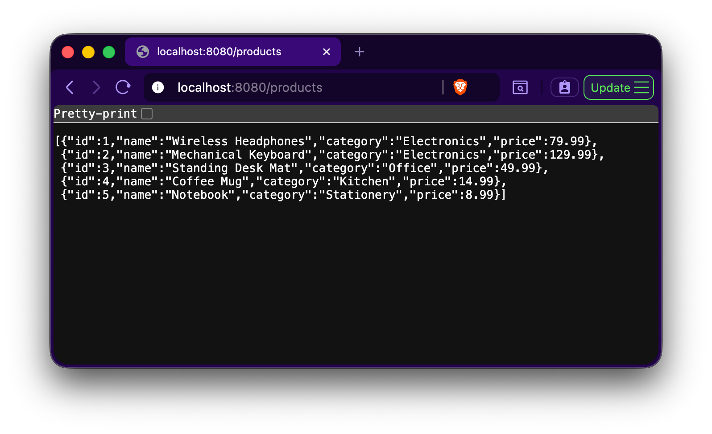

# Infrastructure Take Home

Treat this system as a production system.

## Getting Started

Clone this repository locally.
Create your own public git repository in github or somewhere we can access and push this code into it.
Make changes to your repository.
Getting things to work for you is part of the assessment.

You will be assessed by someone cloning your repository when you're finished and running your instructions to recreate the expected solution.
If we cannot run your repository instructions we cannot assess your work.

### Prerequsites

You will need the following:
* docker runtime and tools
* k3d CLI
* opentofu binary or terraform
* kubectl binary
* git

## Starting point

> **Quick start:** `scripts/run-all.sh` runs all four steps below in sequence. Run `scripts/05-teardown.sh` to destroy everything.

### 1. Provision the cluster and database

Follow the instructions in [`tofu/README.md`](tofu/README.md). This runs in two steps due to a provider initialisation dependency on the k3d cluster existing before Kubernetes resources can be applied.

### 2. Install ArgoCD and deploy PostgREST

Follow the instructions in [`argocd/README.md`](argocd/README.md). This installs ArgoCD into the cluster and applies the ArgoCD Application that deploys PostgREST from the local Helm chart at `charts/postgrest/`.

### 3. Seed the database

```bash
kubectl apply -f k8s/jobs/seed-data.yaml
kubectl wait --for=condition=complete job/seed-data -n postgrest --timeout=60s
```

### 4. Reload the PostgREST schema cache

PostgREST caches the database schema at startup. After the seed job completes, restart the deployment to pick up the new table:

```bash
kubectl rollout restart deployment/postgrest -n postgrest
kubectl rollout status deployment/postgrest -n postgrest
```

PostgREST is now accessible at **http://localhost:8080/products**.

# Problem

Please add commits to your fork of the repo to answer this problem.
Note: the use of the word `postgrest` is confusing, but correct - this is a project that we're going to deploy.

## Add a user to the database

Please add a super user to the postgrest database.

## Inject a secret for postgrest

Creating a superuser account in this new database, inject the secrets into the k3d cluster into a namespace called postgrest.
You must do this with terraform/opentofu.

## Install Postgrest into the k3d cluster

https://docs.postgrest.org/en/v14/

The result should be an accessible endpoint that you can use in your browser.

## Inject some data from the cluster using a `Job`

Use a kubernetes job to inject some data into the postgres database

## Provide an expected screenshot


